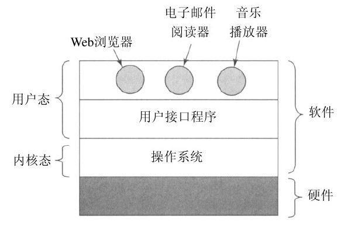

## 操作系统的知识

### 基础知识

​	现代计算机系统由一个或多个处理器、主存、磁盘、打印机、键盘、鼠标、显示器、网络接口以及各种其他输入/输出设备组成。

​	操作系统，为用户程序提供一个更简单、更清晰的计算机模型，并管理所有设备。

​	与用户交互的程序不是操作系统，基于文本的通常称为shell，而基于图标的则称为GUI。

​	**框架图**

在桌面操作系统中，用户态不能直接调用硬件。

OS为应用提供抽象；

OS管理硬件资源：控制 设备、信息  在空间和时间上复用。

### 计算机硬件介绍

处理器CPU

先要了解CPU的基本周期：内存取指令，解码确定 指令类型、操作数，执行。

指令集：控制CPU的方式

寄存器：存储信息

通用寄存器：变量，临时结果

专用寄存器：

1. 程序计数器:执行哪条指令
2. 堆栈指针寄存器:指向内存中当前栈的顶端
3. 程序状态字寄存器:各种CPU的状态码，表面CPU当前状态。

时间多路复用CPU:为了多线程，操作系统经常会保存某个程序所有的寄存器数据，再次运行时重新装入寄存器数据。

流水线CPU：取指单元、解码单元、执行单元

缺点：哪怕有转移指令，取出的指令也必须立即执行。造成很多编程问题。

超标量CPU：分为多个不同的执行单元负责不同的任务，指令解码后放进缓冲区。

缺点：不按顺序执行指令。

​	当在内核态运行时，CPU可以执行指令集中的每一条指令，并且使用硬件的每种功能。操作系统在内核态下运行，从而可以访问整个硬件。

​	相反，用户程序在用户态下运行，仅允许执行整个指令集的一个子集和访问所有功能的一个子集。

​	

用户程序必须使用系统调用（system call）陷入内核并调用操作系统。

多线程或超线程：CPU保持两个不同的线程状态，然后在纳秒级的时间尺度内来回切换。

为了减少等待，提高效率。
